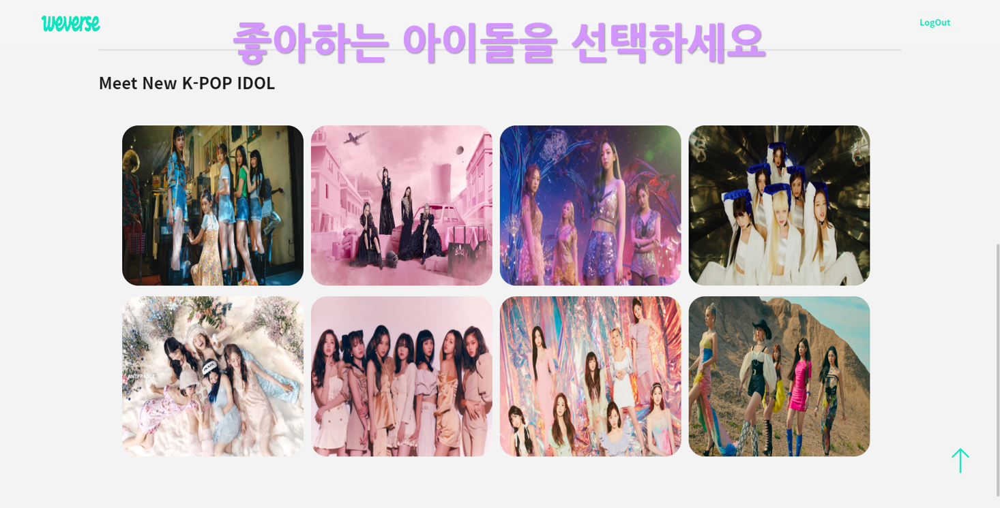
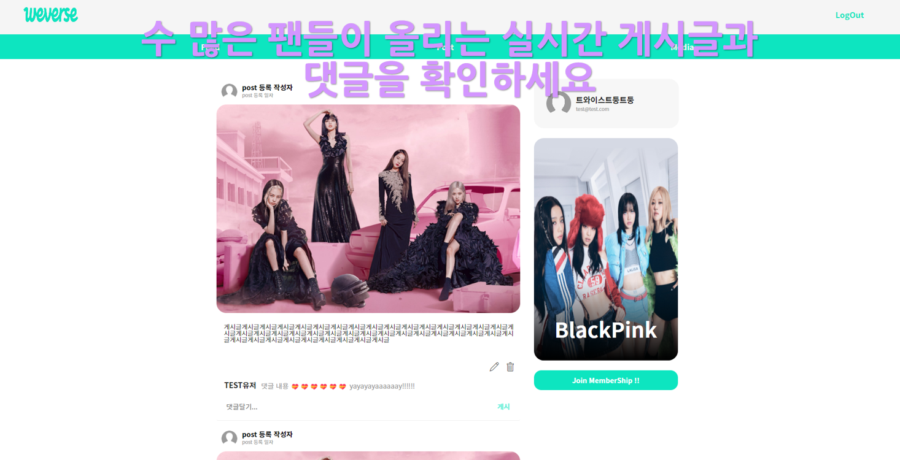
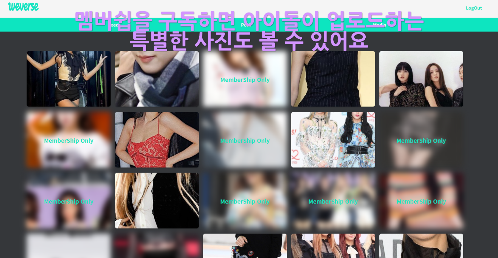
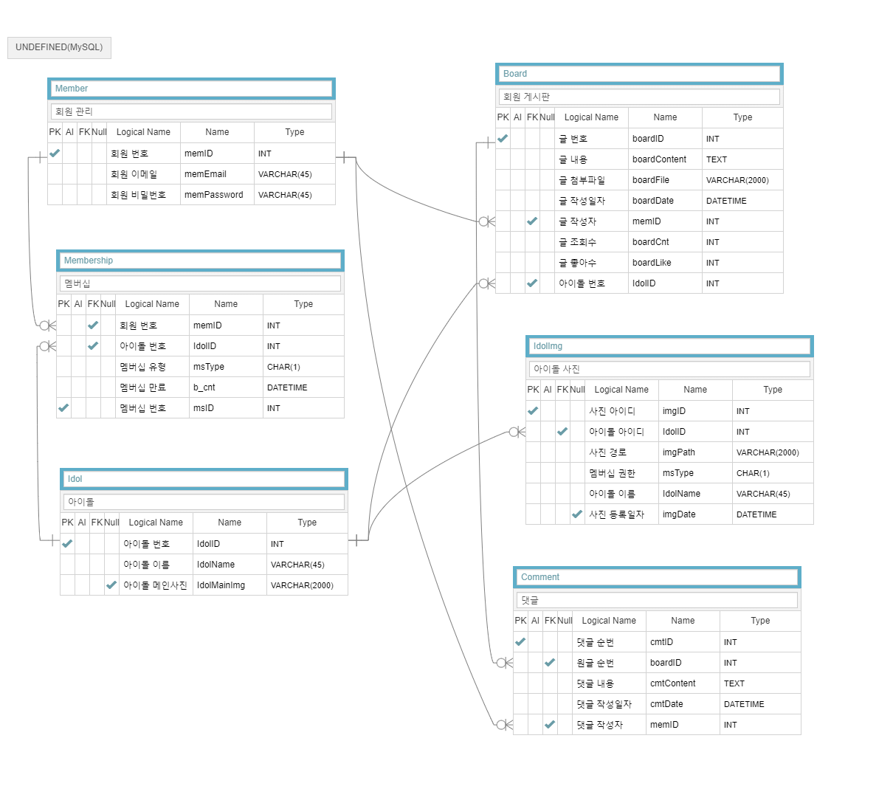
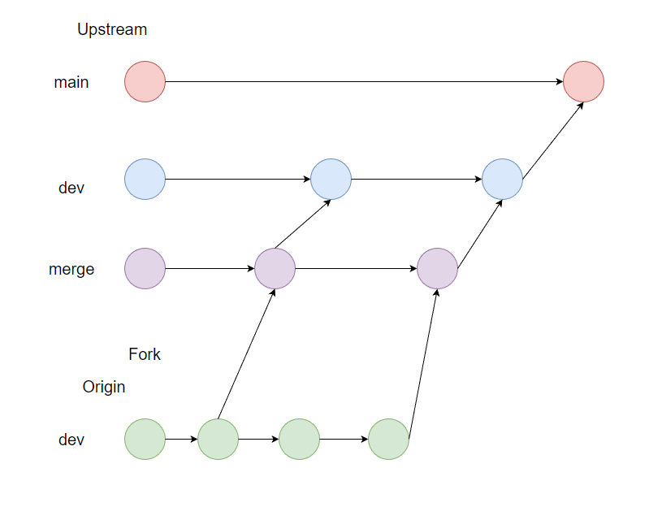

# Fandom

## 🚀 서비스 소개

개발 기간 (2023.02.02 ~ 2023.02.16 2주)  

 

메인화면

 

게시판

 

멤버쉽 회원용 컨텐츠

 

## 💻 실사용 화면

<-- 실사용 화면 GIF -->

 

## 🙇 팀 & 팀원 소개

### 팀 소개

아이티센 그룹 23-1 한국IT직업전문학교 자바&클라우드반 20조

### 팀원 소개

| 김기태                                                                                                                           | 나경민                                                                                                                                 | 유태형                                                                                                                             | 정충근                                                                                                                             |
| ----------------------------------------------------------------------------------------------------------------------------------- | ----------------------------------------------------------------------------------------------------------------------------------------- | ------------------------------------------------------------------------------------------------------------------------------------- | ------------------------------------------------------------------------------------------------------------------------------------- |
|                           |                                 |                             |                             |
|  |  |  |  |

- 팀장 : 정충근
- 팀원 : 김기태, 나경민, 유태형

 

## 🎬 프로젝트 개요

### 주제 선정 이유

평소 관심이 있어 찾아보고 공유하던 아이돌을 좋아하는 사람들이 모여, 아이돌 관련 게시글을 업로드하고 댓글을 달 수도 있습니다. 또한 유료 멤버쉽 구독 시 아이돌이 직접올리는 사진과 동영상을 시청할 수 있고, 소속사에서 올리는 티저를 미리 접할 수 있는 기회를 제공합니다. 사용자는 각각의 아이돌 커뮤니티에 들아가서 게시글을 확인, 작성을 할 수 있고 유료 멤버쉽을 구독할 수 있습니다.

['팬 플랫폼' 관련 기사](https://www.fnnews.com/news/202302071812268248)

### 개선점

- 팬은 유튜브나 방송매체를 찾아 다닐 필요 없이 아이돌을 선택하여 원하는 정보를 얻을 수 있습니다.
- 유료 멤버쉽 구독시 멤버쉽 기간 동안 전용 컨텐츠를 즐길 수 있습니다.
- 아이돌이 게시글에 직접 댓글을 달거나 실시간 스트리밍에서 답변할 수도 있습니다.
- 다른 팬들이 올리는 비공식적 사진이나 게시글도 접할 수 있습니다.

### 기능 목표

#### 1️⃣ Default (기본 기능)

- 회원가입
- 로그인
- 각 아이돌별 커뮤니티
- 게시글 조회
- 게시글 작성
- 댓글 작성
- 멤버쉽 전용 게시판
- 비 멤버쉽 회원은 멤버쉽 전용 게시판 블라인드 처리

---

#### 2️⃣ Plus (추가 되면 좋은 기능)

- 멤버쉽 구독 결제
- 소셜 로그인
- 라이브 스트리밍
- 유튜브, 인스타 등 다른 플랫폼 컨텐츠

 

## 🙋 맡은 역할

### 🙌 정충근

### 🙌 김기태

  

### 🙌 나경민
  

  
### 🙌 유태형

 

## 🧩 기술 스택

### View

-   

-   

### Controller

-   

-   

-  

### 협업 도구

-   

 

## 📃 협업 규칙

### 팀 커뮤니케이션 

- 매주 월 ~ 금 오전 9시까지 한국IT직업전문학교로 출근한다.
- 09시 ~ 17시 20분까지 코딩하며 참여한다.
- 역할과 주제에 맞춰 팀과 원할한 협업을 한다.
- 급한 일이 생기면 최대한 빠르게 팀원들에게 전달한다.

 

### Git, 개발

- Git과 GitHub의 사용법은 미리 숙지한다.
- 공용 레포지토리에서 fork하여 개인 레포지토리에서 개발한다.
- Merge충돌이나 중요한 변경이 있을 시 팀원들에게 전달한다.

 

## 🛠 데이터 설계

 

## 📌 GitHub-Flow

